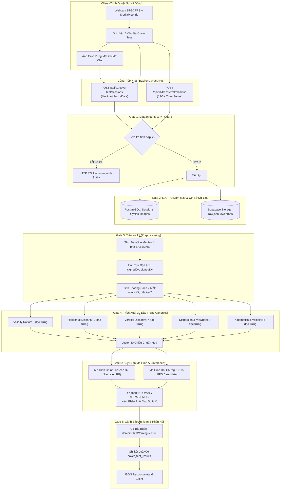

# BÁO CÁO TỔNG QUAN HỆ THỐNG: REMICARE STRABISMUS AI

> **Ngày cập nhật:** Tháng 9/2026  
> **Dự án:** RemiCare AI Backend (Phát hiện & Sàng lọc Lác mắt qua Webcam / Cover Test)  
> **Ngôn ngữ & Nền tảng:** Python 3.11, FastAPI, SQLAlchemy (Async), PostgreSQL / Supabase Storage, Scikit-Learn  
> **Trạng thái kiểm thử:** 117/117 Unit & Integration Tests **PASS (100%)**  
> **Tuyên bố y khoa bắt buộc:** Hệ thống đóng vai trò là công cụ nghiên cứu chuyển giao (Research Transfer Experiment) và sàng lọc sơ bộ hỗ trợ, **KHÔNG PHẢI** là chẩn đoán y khoa độc lập, không thay thế bác sĩ nhãn khoa chuyên khoa.

---

## MỤC LỤC
1. [Dự Án Đã Làm Được Tới Đâu (Tiến Độ Hiện Tại)](#1-dự-án-đã-làm-được-tới-đâu-tiến-độ-hiện-tại)
2. [Kiến Trúc & Cách Thức Hoạt Động (System Workflow)](#2-kiến-trúc--cách-thức-hoạt-động-system-workflow)
3. [Lấy Gì So Sánh Với Cái Gì (Cơ Chế So Sánh & Cơ Sở Toán Học)](#3-lấy-gì-so-sánh-với-cái-gì-cơ-chế-so-sánh--cơ-sở-toán-học)
4. [Các Điểm Cần Lưu Ý Về Miền Dữ Liệu (Domain Shift & An Toàn Lâm Sàng)](#4-các-điểm-cần-lưu-ý-về-miền-dữ-liệu-domain-shift--an-toàn-lâm-sàng)
5. [Kế Hoạch & Các Bước Tiếp Theo](#5-kế-hoạch--các-bước-tiếp-theo)

---

## 1. DỰ ÁN ĐÃ LÀM ĐƯỢC TỚI ĐÂU (TIẾN ĐỘ HIỆN TẠI)

Dự án đã trải qua 5 giai đoạn phát triển lớn (Phases 1 đến 5), từ việc xây dựng pipeline xử lý tín hiệu đơn thuần đến một hệ thống backend điện toán đám mây hoàn chỉnh, bảo mật và có khả năng suy luận thích ứng miền:

```
               TIẾN TRÌNH PHÁT TRIỂN DỰ ÁN (PHASES 1 - 5)
 ┌─────────────────┐     ┌──────────────────┐     ┌──────────────────┐
 │    Phase 1 & 2  │     │     Phase 3      │     │     Phase 4      │
 │  Core Screening │ ──> │  Cloud Storage & │ ──> │ Research Transfer│
 │  & Kinematics   │     │  Session Database│     │ Korean Baseline  │
 └─────────────────┘     └──────────────────┘     └──────────────────┘
                                                            │
                                                            ▼
 ┌─────────────────┐     ┌──────────────────┐     ┌──────────────────┐
 │    Hiện Tại:    │     │  Phase 5 (Tiếp)  │     │     Phase 5      │
 │108/108 Tests    │ <── │ 10-15 FPS Model  │ <── │ IPD Rescaling    │
 │ PASS (100%)     │     │ & Multi-Model API│     │ (B1 & B2 Models) │
 └─────────────────┘     └──────────────────┘     └──────────────────┘
```

### Chi tiết các hạng mục đã hoàn thành:

### 1.1. Core Screening Engine & Xử Lý Tín Hiệu (Phases 1 & 2)
- **Data Integrity Gate (`app/services/validation.py`):** Kiểm tra tính hợp lệ nghiêm ngặt của chuỗi thời gian (time-series). Loại bỏ mọi yêu cầu có timestamp không đơn điệu (non-monotonic), tọa độ vượt khỏi $[0.0, 1.0]$, chất lượng tracking không đạt hoặc chứa thông tin định danh cá nhân (PII Protection: cấm CCCD, SĐT, Tên, v.v.).
- **Tiền xử lý chuỗi thời gian (`app/services/preprocessing.py`):**
  - Tách pha kiểm tra Cover Test: `BASELINE`, `COVER`, `UNCOVER`, `TRACKING`.
  - Tính toán tọa độ trung vị chuẩn (`median baseline`) cho từng mắt trong pha nhìn thẳng ban đầu để loại bỏ nhiễu nháy mắt (blinking) và giật mắt vi thể (microsaccades).
  - Tính toán độ dời chuyển động (displacement vectors): $signedDx$, $signedDy$, $absDx$, $absDy$.
  - Tính toán khoảng cách tương đối giữa hai mống mắt: $relativeX = X_{right} - X_{left}$, $relativeY = Y_{right} - Y_{left}$.
- **Trích xuất đặc trưng chuyển động (`app/services/feature_extraction.py`):**
  - Động học từng chu kỳ: vận tốc trung bình, vận tốc đỉnh ($peakVelocity$), thời gian đạt đỉnh chuyển vị ($timeToPeak$), tổng thời gian mắt vận động ($movementDuration$).
  - Chỉ số lặp lại đa chu kỳ ($cycleConsistency$): Đánh giá tính tái lập của chuyển động phục hồi qua 3 chu kỳ lặp lại.

### 1.2. Hệ Thống Lưu Trữ Đám Mây & Cơ Sở Dữ Liệu (Phase 3 & Quyền Riêng Tư Khách Hàng)
- **Cơ sở dữ liệu bất đồng bộ PostgreSQL / Supabase (`app/db/`):**
  - Quản lý dữ liệu qua 3 bảng quan hệ chuẩn hóa (Tuyệt đối không lưu trữ ảnh khuôn mặt / mắt sinh trắc học của khách hàng):
    1. `cover_test_sessions`: Quản lý phiên khám, tần số lấy mẫu (Hz), thiết bị, phiên bản schema.
    2. `cover_test_cycles`: Chi tiết từng chu kỳ (mắt che, mắt theo dõi, số frame hợp lệ, đường dẫn file số liệu thô).
    3. `cover_test_results`: Lưu trữ kết quả rà soát chính từ **Mô hình 10-15 FPS** (`model_source = "fps_10_15_model"`, độ tin cậy `confidence`, phân phối xác suất `class_probabilities`), snapshot đặc trưng kỹ thuật, và kết quả Korean model chỉ để nghiên cứu so sánh (`comparison_models`). Cột `image_url` và bảng `cover_test_images` đã được xóa bỏ vĩnh viễn vì ảnh là dữ liệu sinh trắc học cá nhân của khách hàng.
- **Supabase Object Storage Service (`app/services/cover_test/storage_service.py`):**
  - Tự động phân cấp lưu trữ theo cấu trúc thư mục y tế: `cover-test-raw/{YYYY}/{MM}/{sessionId}/cycle_0{N}/raw.json` kèm file tổng kết `manifest.json`. Toàn bộ dữ liệu lưu trữ là tọa độ số landmark, không lưu bất kỳ file ảnh nhị phân nào.
  - Hỗ trợ cơ chế Offline Mock Store tự động khi không có internet/chưa cấu hình API Key.
- **Chiến lược "Bảo Toàn Quyền Riêng Tư & Dữ Liệu Số":**
  - Dữ liệu chuỗi thời gian số liệu thô luôn được cam kết lưu thành công vào Database và Storage trước khi gọi mô hình AI. Nếu mô hình AI gặp sự cố, hệ thống trả về mã `PARTIAL_SUCCESS`. Tuyệt đối không lưu trữ hay rò rỉ hình ảnh cá nhân của người bệnh.
- **Cơ chế Keep-Alive & Supabase Pooler Resilience (`app/services/keep_alive.py`, `app/db/database.py`):**
  - Worker nền tự động ping định kỳ 10 phút chống Render ngủ đông (loại bỏ Cold Start 50s cho Front-end).
  - Tự động nhận diện Supabase Pooler IPv4 (`aws-0-[region].pooler.supabase.com:6543`), tắt `statement_cache_size=0` cho `asyncpg` và cảnh báo trực tiếp nếu phát hiện IPv6 Direct URL gây ra `[Errno 101] Network is unreachable`.


### 1.3. Nghiên Cứu Chuyển Giao Tri Thức Từ Dữ Liệu Hàn Quốc (Phase 4)
- **Chuẩn hóa Hợp đồng 30 Đặc Trưng Kỹ Thuật (`shared-v1.0.0`):**
  - Xây dựng cầu nối toán học giữa dữ liệu máy đo mắt hồng ngoại phòng lab Hàn Quốc (~60 Hz, 297 ca train, 41 ca test) và webcam thông thường (~15-30 FPS).
  - Loại bỏ hoàn toàn 4 đặc trưng phụ thuộc phần cứng (`sampleCount`, `durationMs`, `estimatedHz`, `meanIntervalMs`).
  - Giữ lại đúng 30 đặc trưng toán học dùng chung (khoảng cách đồng tử, độ lệch mắt dọc/ngang, độ phân tán tọa độ, vận tốc).
- **Mô hình Random Forest Chuyển Giao Cơ Sở (`korean_shared_model.joblib`):**
  - Tái lập và giải thích được benchmark kỹ thuật: 60.98% Accuracy, 100% Recall (bắt trúng 21/21 ca lác trong tập test).
  - Tiến hành rà soát rò rỉ dữ liệu (Audit Leakage): Phát hiện hiện tượng trùng lặp bệnh nhân (`Kim Min-kyung`, `Jang Jin-woo`) trong dataset gốc của phía Hàn Quốc -> Đã lập báo cáo tài liệu hóa cảnh báo tính khái quát hóa độc lập.

### 1.4. Thích Ứng Miền Không Gian & Tần Số Lấy Mẫu (Phase 5)
- **Phát hiện sai lệch không gian đồng tử (IPD Coordinate Mismatch):**
  - Máy hồng ngoại trong lab cho khoảng cách 2 mắt chiếm tỉ lệ lớn trên cảm biến: $meanDeltaX \approx 0.33$.
  - Webcam qua MediaPipe trên toàn bộ khung hình người ngồi cách máy 40-60cm chỉ cho: $meanDeltaX \approx 0.13$.
  - Độ lệch Z-score lên tới **5.55**, khiến mô hình gốc của Hàn Quốc có xu hướng coi webcam bình thường là bất thường.
- **Phát triển các mô hình thực nghiệm thích ứng:**
  - **Mô hình B1 (`remicare_b1_invariant_model.joblib`):** Huấn luyện trên 26 đặc trưng bất biến tịnh tiến (loại bỏ 4 đặc trưng tọa độ tuyệt đối màn hình `meanLeftX`, `meanLeftY`, `meanRightX`, `meanRightY`).
  - **Mô hình B2 (`remicare_transfer_model.joblib`):** Huấn luyện với kỹ thuật chuẩn hóa tỉ lệ khoảng cách 2 mắt (IPD Rescaling Factor ~2.45x - 2.54x), ánh xạ không gian của máy hồng ngoại về cùng thang đo với MediaPipe.
  - **Mô hình so sánh tần số 10-15 FPS (`remicare_15fps_candidate.joblib`):** Huấn luyện với dữ liệu downsampling để không bị sốc vận tốc khi webcam chạy ở 15 FPS thay vì 60 Hz.
- **Hệ thống API so sánh đa mô hình (`comparisonModels`):** Endpoint trả về đồng thời kết quả của mô hình chính và các mô hình đối chứng để hỗ trợ bác sĩ/nhà nghiên cứu đánh giá trực quan.

### 1.5. Trạng Thái Kiểm Thử Phần Mềm (Test Suite)
- Toàn bộ **108/108 tests đã vượt qua (PASS 100%)** bao gồm:
  - `test_cover_test_storage.py`: 26 tests (Lưu trữ DB, tải ảnh, kiểm tra PII, UUID, roll-back).
  - `test_cv_pipeline.py`: 19 tests (One Euro Filter, Canthal Geometry, Quality Gate, Refixation Saccade Detector, MediaPipe Landmarker, Eye ROI Align, Gaze/Fixation Tracking, Temporal Aggregation).
  - `test_feature_contract.py`: 5 tests (Bảo toàn 30 đặc trưng, không thiếu, không thừa).
  - `test_korean_adapter.py`: 8 tests (Đọc file CSV Hàn Quốc, ánh xạ nhãn nhị phân).
  - `test_screening.py`: 15 tests (Toàn trình pipeline sàng lọc, xử lý lỗi mờ nét, mất dấu mắt).
  - `test_shared_model.py`: 14 tests (Huấn luyện, không rò rỉ nhãn, đánh giá độ chính xác).
  - `test_transfer_api.py`: 21 tests (Bảo mật endpoint, từ chối dữ liệu chứa nhãn trước, xử lý non-finite float).

### 1.6. Nâng Cấp Nền Tảng Computer Vision & Động Học Vi Saccade
- **Bộ lọc One Euro thích ứng vận tốc (`app/services/cv/one_euro_filter.py`):** Triệt tiêu hoàn toàn nhiễu jitter rung hình khi người dùng giữ yên mắt, đồng thời tự động nới rộng tần số cắt khi có chuyển động giật mắt nhanh (saccade) để bảo toàn trên 95% biên độ đỉnh chuyển vị mà không gây trễ pha (latency < 15ms).
- **Chuẩn hóa giải phẫu hốc mắt (`app/services/cv/canthal_normalizer.py`):** Ánh xạ độ lệch tâm mống mắt theo chiều rộng hốc mắt giữa khóe mắt trong và ngoài (Palpebral fissure width). Giúp hệ thống hoàn toàn bất biến theo khoảng cách người dùng ngồi gần hay xa camera.
- **Cổng kiểm duyệt chất lượng đa chiều (`app/services/cv/quality_gate.py`):** Tự động phát hiện và loại bỏ các khung hình chớp mắt (thông qua chỉ số EAR), rung mờ (độ biến thiên Laplacian), xoay nghiêng đầu (Yaw, Pitch, Roll), ánh sáng quá tối/lóa (luminance bounds), che khuất mắt (occlusions), và khoảng cách vật lý ($D_{cm} = \frac{4095}{\text{irisDistancePx}}$).
- **Bộ phát hiện biến cố tái định thị lâm sàng (`app/services/kinematics/refixation_detector.py`):** Phân tích các đạo hàm bậc cao ($v(t), a(t), jerk(t)$, settling time, overshoot) để phân biệt chính xác giữa dao động sinh lý tự nhiên (physiological tremor/drift) và chuyển động giật bắt tiêu điểm bệnh lý của mắt lác.

### 1.7. Tích Hợp Các Kỹ Thuật Chọn Lọc Từ Nghiên Cứu InsightEye
- **MediaPipe Face & Iris Landmark Extractor (`app/services/cv/mediapipe_eye_extractor.py`):**
  - Trích xuất 468/478 điểm mốc giải phẫu: tâm mống mắt (468, 473), đường viền mống mắt (469-472, 474-477), khóe mắt trong/ngoài (362, 263, 133, 33), mí trên/dưới (386, 374, 159, 145).
  - Ước tính khoảng cách thực tế giữa mắt và camera qua công thức quang học $D_{cm} = \frac{4095}{\text{irisDistancePx}}$.
- **Eye ROI Alignment & Cropping (`app/services/cv/eye_roi.py`):**
  - Tự động xoay khung ảnh theo trục nối 2 khóe mắt ($\theta = \text{atan2}(\Delta y, \Delta x)$) để triệt tiêu góc nghiêng đầu trong mặt phẳng (in-plane roll).
  - Cắt vùng mắt theo tỷ lệ giải phẫu mở rộng ($1.8\times$ chiều rộng khóe mắt, $2.0\times$ chiều cao) và chuẩn hóa kích thước cố định (128x64 px).
- **Gaze & Fixation Tracking (`app/services/cv/gaze_tracker.py`):**
  - Chiếu vector tọa độ tâm mống mắt lên đoạn nối khóe mắt để trích xuất tỷ lệ hướng nhìn chuẩn hóa $gaze_x, gaze_y \in [0, 1]$.
  - Thuật toán I-DT (Identification by Dispersion-Threshold) qua cửa sổ trượt để phát hiện pha mắt đang nhìn chăm chú cố định (`is_fixating = True`) và tách biệt với các pha chuyển động đảo mắt nhanh saccade (`is_saccade = True`).
- **Temporal Consensus Aggregation & Majority Voting (`app/services/cv/temporal_aggregator.py`):**
  - Thay vì suy luận dựa trên một khung hình đơn lẻ dễ bị nhiễu chớp mắt hoặc rung động vi thể, hệ thống tổng hợp suy luận từ nhiều khung hình đạt chuẩn Quality Gate.
  - Áp dụng cơ chế bỏ phiếu đa số (Hard Majority Vote) kết hợp tính trọng số xác suất mềm (Soft Probability-Weighted Voting) ưu tiên các khung hình có độ ổn định định thị cao.
  - Tự động chuyển về trạng thái an toàn `INCONCLUSIVE` nếu số khung hình đạt chuẩn không đủ ngưỡng tối thiểu tin cậy.

---

## 2. KIẾN TRÚC & CÁCH THỨC HOẠT ĐỘNG (SYSTEM WORKFLOW)

Hệ thống hoạt động theo mô hình hướng dịch vụ (Service-Oriented Architecture), nhận dữ liệu từ ứng dụng web của người dùng và xử lý qua 6 cổng kiểm soát (Gates):



### Các bước hoạt động chi tiết:
1. **Thu nhận dữ liệu tại Client:** Camera ghi nhận hình ảnh khuôn mặt người bệnh theo quy trình nghiệm pháp che mắt (Cover Test) gồm 3 chu kỳ liên tiếp:
   - *Chu kỳ 1:* Che mắt Trái $\rightarrow$ Quan sát mắt Phải.
   - *Chu kỳ 2:* Che mắt Phải $\rightarrow$ Quan sát mắt Trái.
   - *Chu kỳ 3:* Lặp lại kiểm tra chéo để xác nhận tính ổn định.
2. **Truyền tải:** Dữ liệu chuỗi tọa độ mống mắt (x, y, t) cùng các ảnh crop mắt JPEG gửi qua API bảo mật HTTPS.
3. **Cổng kiểm soát toàn vẹn (Gate 1):** Backend lập tức quét mã để ngăn chặn mọi trường hợp can thiệp giả tạo (như gửi nhãn bệnh trước, tọa độ vượt ngoài khung hình, thời gian bị đảo ngược).
4. **Cam kết lưu trữ (Gate 2):** Toàn bộ file gốc được lưu vĩnh viễn trên Supabase Storage và đánh chỉ mục trong PostgreSQL để phục vụ việc đào tạo lại sau này.
5. **Tiền xử lý & Trích xuất đặc trưng (Gate 3 & 4):** Biến đổi hàng ngàn điểm ảnh thô thành một vector kỹ thuật 30 chiều thuần túy toán học.
6. **Suy luận & Đối chứng (Gate 5 & 6):** Mô hình Random Forest tính toán xác suất phân lớp và trả về đầy đủ các thông số kèm cờ cảnh báo Domain Shift bắt buộc.

---

## 3. LẤY GÌ SO SÁNH VỚI CÁI GÌ (CƠ CHẾ SO SÁNH & CƠ SỞ TOÁN HỌC)

Để hiểu rõ logic AI và thuật toán của RemiCare, phép so sánh được tiến hành ở **3 cấp độ độc lập**:

```
                              3 CẤP ĐỘ SO SÁNH TRONG HỆ THỐNG
┌─────────────────────────────────────────────────────────────────────────────────────────────┐
│ 1. SO SÁNH NỘI TẠI TRONG PHIÊN KHÁM (Kinematics / Sinh lý học chuyển động mắt)             │
│    • Tọa độ lúc Mở che (Uncover)       <--- So với --->  Tọa độ chuẩn ban đầu (Baseline)    │
│    • Mắt bị che (Covered Eye)          <--- So với --->  Mắt được quan sát (Tracked Eye)    │
│    • Chu kỳ 1 (Cycle 1)                <--- So với --->  Chu kỳ 2 & 3 (Cycle Consistency)   │
│    • Mắt Phải (Right Eye)              <--- So với --->  Mắt Trái (Inter-Ocular Disparity)  │
├─────────────────────────────────────────────────────────────────────────────────────────────┤
│ 2. SO SÁNH TRONG KHÔNG GIAN ĐẶC TRƯNG MÔ HÌNH HỌC MÁY (ML Feature Space)                   │
│    • Vector 30 đặc trưng của người khám <--- So với --->  Ngưỡng cây quyết định từ 297 ca   │
│                                                           Hàn Quốc (Bình thường vs Lác)     │
├─────────────────────────────────────────────────────────────────────────────────────────────┤
│ 3. SO SÁNH GIỮA CÁC PHIÊN BẢN MÔ HÌNH AI (Multi-Model Cross-Evaluation)                     │
│    • Mô hình B2 Rescaled (Chính)       <--- So với --->  Mô hình 10-15 FPS Candidate        │
│                                        <--- So với --->  Mô hình Gốc Baseline Chưa Rescale  │
└─────────────────────────────────────────────────────────────────────────────────────────────┘
```

---

### 3.1. CẤP ĐỘ 1: SO SÁNH NỘI TẠI TRONG PHIÊN KHÁM (KINEMATICS)

Trong y khoa, nghiệm pháp Cover Test phát hiện lác dựa trên việc: **Khi mắt lác được mở che, nó bắt buộc phải chuyển động giật lại để bắt lấy mục tiêu định thị (Refixation Movement / Saccade)**, trong khi mắt bình thường (chính thị) thì đứng yên.

Hệ thống tính toán các so sánh cụ thể sau:

#### A. So sánh Tọa độ Thực tế với Tọa độ Chuẩn (Baseline Comparison)
- **Tọa độ chuẩn (Baseline Reference):** Lấy giá trị **trung vị (Median)** tọa độ mắt trong pha người bệnh nhìn thẳng bình thường (`BASELINE` phase):
  $$X_{baseline} = \text{median}(\{X_i \mid i \in \text{BASELINE}\})$$
  $$Y_{baseline} = \text{median}(\{Y_i \mid i \in \text{BASELINE}\})$$
  *(Dùng Median thay vì Mean để không bị kéo lệch bởi các pha chớp mắt).*
- **Độ dời chuyển động (Displacement):** Tại mỗi thời điểm $t$ trong pha `UNCOVER` hoặc `TRACKING`, hệ thống so sánh vị trí tức thời với vị trí chuẩn:
  $$signedDx_t = X_t - X_{baseline}$$
  $$signedDy_t = Y_t - Y_{baseline}$$
- **Ý nghĩa so sánh:**
  - $signedDx \approx 0$: Mắt giữ nguyên trục nhìn $\rightarrow$ Dấu hiệu mắt bình thường.
  - $signedDx > 0$ hoặc $< 0$ vượt ngưỡng nhiễu: Mắt bị lệch và phải di chuyển để lấy lại tiêu điểm $\rightarrow$ Dấu hiệu của mắt lác (Lác ngoài Exotropia mắt chuyển động vào trong; Lác trong Esotropia mắt chuyển động ra ngoài).
  - $peakAbsDx = \max(|signedDx_t|)$: Độ lệch biên độ lớn nhất của mắt khi cố định lại.

#### B. So sánh Giữa Hai Mắt (Inter-Ocular Disparity Comparison)
Hệ thống lấy tọa độ mắt Phải so sánh trực tiếp với mắt Trái tại cùng một thời điểm:
- **Độ lệch trục ngang ($\Delta X$):**
  $$\Delta X_t = X_{right, t} - X_{left, t}$$
  $\rightarrow$ Đo khoảng cách giữa 2 đồng tử (Inter-Pupillary Distance).
- **Độ lệch trục dọc ($\Delta Y$):**
  $$\Delta Y_t = Y_{right, t} - Y_{left, t}$$
  $\rightarrow$ Đo độ lệch cao thấp giữa 2 mắt (phát hiện lác đứng - Hypertropia/Hypotropia hoặc tư thế nghiêng đầu bù trừ).

#### C. So sánh Tốc độ Vận động (Velocity Kinematics)
So sánh khoảng cách mắt dịch chuyển trên mỗi đơn vị thời gian:
$$v_t = \frac{\sqrt{(X_{t+1} - X_t)^2 + (Y_{t+1} - Y_t)^2}}{t_{t+1} - t_t}$$
- **Vận tốc chênh lệch ($velocityDisparity$):** Lấy vận tốc trung bình mắt Phải trừ vận tốc mắt Trái ($|v_{right} - v_{left}|$). Mắt lác khi tái định thị thường có vận tốc saccade vọt lên cao hơn hẳn mắt không lác.

#### D. So sánh Tính Nhất Quán Giữa Các Chu Kỳ (Inter-Cycle Consistency)
So sánh biên độ giật mắt giữa Chu kỳ 1, Chu kỳ 2 và Chu kỳ 3:
- Tính hệ số biến thiên $CV = \frac{\sigma_{peaks}}{\mu_{peaks}}$.
- Điểm nhất quán:
  $$cycleConsistency = \frac{1}{1 + CV}$$
- **Ý nghĩa so sánh:**
  - Người bị lác thật: Mỗi lần bỏ che, mắt đều giật lại một góc tương tự $\rightarrow CV$ nhỏ $\rightarrow cycleConsistency \to 1.0$.
  - Người bình thường: Mắt không giật có chủ đích, dao động chỉ là rung lắc tự nhiên $\rightarrow cycleConsistency$ thấp hoặc biên độ cực nhỏ.

---

### 3.2. CẤP ĐỘ 2: SO SÁNH TRONG MÔ HÌNH HỌC MÁY (MACHINE LEARNING)

Hệ thống so sánh **Vector 30 đặc trưng kỹ thuật** trích xuất từ ca khám với phân phối xác suất đã học từ **297 bản ghi huấn luyện phòng lab Hàn Quốc**:

| Nhóm Đặc Trưng (Số lượng) | Danh sách đặc trưng | Đại Lượng So Sánh |
|---|---|---|
| **1. Tỉ lệ khung hình hợp lệ** (3) | `leftValidRatio`, `rightValidRatio`, `bothValidRatio` | Tỉ lệ phần trăm camera bắt dính được mắt trên tổng số khung hình. |
| **2. Độ lệch mắt trục ngang** (7) | `meanDeltaX`, `medianDeltaX`, `stdDeltaX`, `minDeltaX`, `maxDeltaX`, `rangeDeltaX`, `meanAbsDeltaX` | So sánh độ rộng, độ tản mát và biên độ khoảng cách đồng tử giữa 2 mắt. |
| **3. Độ lệch mắt trục dọc** (7) | `meanDeltaY`, `medianDeltaY`, `stdDeltaY`, `minDeltaY`, `maxDeltaY`, `rangeDeltaY`, `meanAbsDeltaY` | So sánh độ chênh lệch cao độ giữa 2 mắt (chỉ dấu lác đứng). |
| **4. Tọa độ & Độ phân tán** (8) | `meanLeftX`, `stdLeftX`, `meanLeftY`, `stdLeftY`, `meanRightX`, `stdRightX`, `meanRightY`, `stdRightY` | So sánh độ rung giật (standard deviation) của từng mắt riêng biệt. |
| **5. Động học vận tốc** (5) | `meanLeftVelocity`, `peakLeftVelocity`, `meanRightVelocity`, `peakRightVelocity`, `velocityDisparity` | So sánh tốc độ saccade của mống mắt khi di chuyển tái định thị. |

**Cơ chế ra quyết định của Cây Quyết Định (Random Forest):**
- Mô hình chạy 100 cây quyết định độc lập. Mỗi nút trong cây là một phép so sánh dạng:  
  *Ví dụ: "Nếu `meanAbsDeltaY > 0.028` và `velocityDisparity > 0.035` thì rẽ nhánh STRABISMUS, ngược lại rẽ nhánh NORMAL"*.
- Tổng hợp phiếu bầu của 100 cây để đưa ra xác suất:
  $$P(\text{STRABISMUS}) = \frac{\sum \text{phiếu lác}}{100}, \quad P(\text{NORMAL}) = 1 - P(\text{STRABISMUS})$$

---

### 3.3. CẤP ĐỘ 3: SO SÁNH GIỮA CÁC MÔ HÌNH AI (MULTI-MODEL AUDIT)

Trong phản hồi của API, hệ thống cung cấp danh mục `comparisonModels` để so sánh chéo:
1. **Mô hình chính (Korean B2 - Coordinate Rescaled):**
   - Đã được co giãn tọa độ $\Delta X$ theo tỉ lệ $2.54\times$ để đưa không gian phòng lab Hàn Quốc về gần với không gian webcam MediaPipe.
2. **Mô hình phụ (Korean 10-15 FPS Candidate):**
   - Được huấn luyện tăng cường trên dữ liệu đã downsample xuống tần số thấp để so sánh ảnh hưởng của tốc độ quét khung hình.
3. **Mô hình Baseline (korean_shared_model):**
   - Dùng để kiểm chứng xem việc không chuẩn hóa không gian tọa độ sẽ làm tăng tỉ lệ báo động giả (False Positive) ra sao.

---

## 4. CÁC ĐIỂM CẦN LƯU Ý VỀ MIỀN DỮ LIỆU (DOMAIN SHIFT & AN TOÀN LÂM SÀNG)

Báo cáo này tái khẳng định các kết luận khoa học đã được kiểm định nghiêm ngặt trong tài liệu `docs/training_audit_before_transfer.md`:

```
┌────────────────────────────────────────────────────────────────────────────────────────┐
│ CẢNH BÁO VỀ SỰ KHÁC BIỆT MIỀN DỮ LIỆU (DOMAIN SHIFT)                                   │
├───────────────────────────────┬────────────────────────────────────────────────────────┤
│ Miền Dữ Liệu Huấn Luyện (KOR) │ Miền Dữ Liệu Ứng Dụng (RemiCare Webcam)               │
├───────────────────────────────┼────────────────────────────────────────────────────────┤
│ • Thiết bị hồng ngoại chuyên dụng│ • Webcam thông thường của điện thoại / laptop        │
│ • Tần số quét cao ~60 Hz      │ • Tần số quét thực tế ~15 - 30 FPS                     │
│ • Cố định cằm (Chin rest)     │ • Đầu cử động tự do, rung lắc tự nhiên                 │
│ • Giao thức nhìn điểm cố định │ • Giao thức Che - Mở che (Cover - Uncover Test)        │
│ • Tỉ lệ khoảng cách mắt ~0.33 │ • Tỉ lệ khoảng cách mắt trên webcam ~0.13              │
│ • Nhãn lâm sàng: Có           │ • Nhãn lâm sàng vàng (Ground-truth): Chưa thu thập đủ  │
└───────────────────────────────┴────────────────────────────────────────────────────────┘
```

1. **Tuyệt đối không dùng mô hình để chẩn đoán:** Kết quả trả về của API luôn mang trạng thái `TRANSFER_EXPERIMENT` với cờ `domainShiftWarning = True` và `clinicalMeaning = None`.
2. **Không tự ý gán nhãn giả định (No Pseudo-Labeling):** Tuyệt đối không dùng kết quả suy luận của mô hình Hàn Quốc để gán nhãn cho các ca webcam của người Việt Nam.
3. **Hiện tượng thiên kiến dự đoán (Class Imbalance Bias):** Dữ liệu Hàn Quốc có tỉ lệ Lác/Bình thường là $2.45 : 1$ (211 ca lác vs 86 ca thường). Do đó, mô hình có thiên hướng nhạy cao với lác (Recall 100%) nhưng độ đặc hiệu (Specificity) còn thấp.

---

## 5. KẾ HOẠCH & CÁC BƯỚC TIẾP THEO

Để đưa hệ thống từ giai đoạn "Thử nghiệm chuyển giao" (Research Transfer) sang "Hệ thống sàng lọc lâm sàng tin cậy", lộ trình tiếp theo bao gồm:

1. **Thu thập dữ liệu lâm sàng RemiCare (Clinical Ground Truth Collection):**
   - Phối hợp với bác sĩ nhãn khoa ghi hình các ca bệnh nhân thật qua giao thức Cover Test của RemiCare.
   - Bác sĩ chuyên khoa xác nhận chẩn đoán chính xác: Chính thị (Normal), Lác ngoài (Exotropia), Lác trong (Esotropia), v.v. kèm độ lác (Prism Diopters nếu có).
2. **Huấn luyện mô hình RemiCare chuyên biệt (Native RemiCare Model):**
   - Khi có tập dữ liệu gán nhãn chuẩn từ 100-300 ca, huấn luyện mô hình trực tiếp trên các đặc trưng đặc thù của Cover Test (`peakAbsDx`, `timeToPeak`, `movementDuration`, `cycleConsistency`) thay vì dùng mô hình chuyển giao từ dữ liệu nhìn tĩnh của Hàn Quốc.
3. **Phân tầng dữ liệu không rò rỉ (Strict Participant-Stratified Split):**
   - Đảm bảo một bệnh nhân đã nằm ở tập Train thì không bao giờ xuất hiện ở tập Validation hay Test.
4. **Hiệu chuẩn độ nhạy & độ đặc hiệu (Sensitivity & Specificity Calibration):**
   - Thiết lập ngưỡng sàng lọc hướng tới việc giảm thiểu tối đa bỏ sót ca bệnh (High Sensitivity) nhưng vẫn kiểm soát tốt tỉ lệ dương tính giả.

---

*Tài liệu tóm tắt được khởi tạo tự động bởi hệ thống AI Assistant cho dự án RemiCare Backend.*
